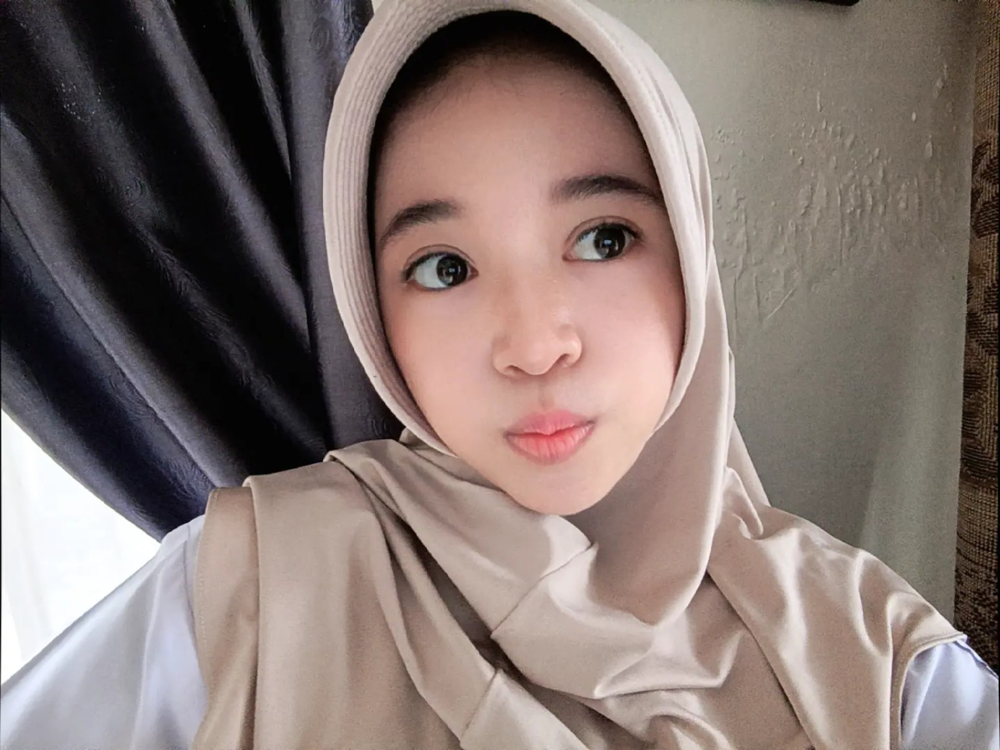
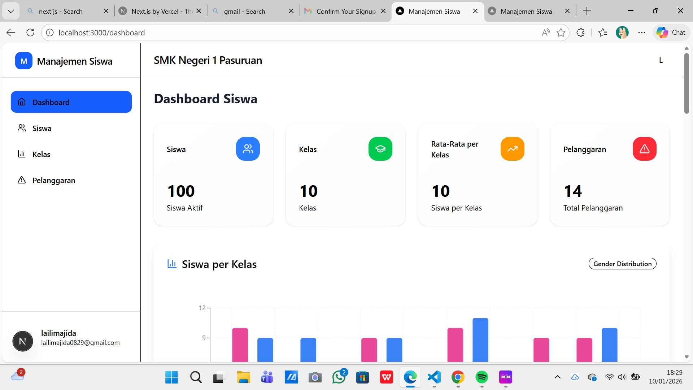
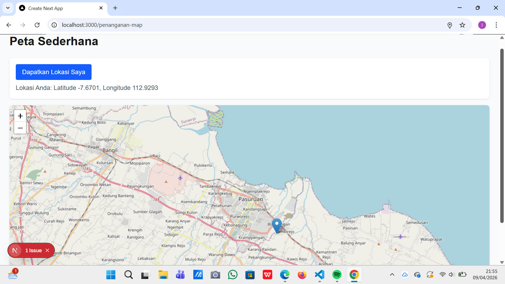
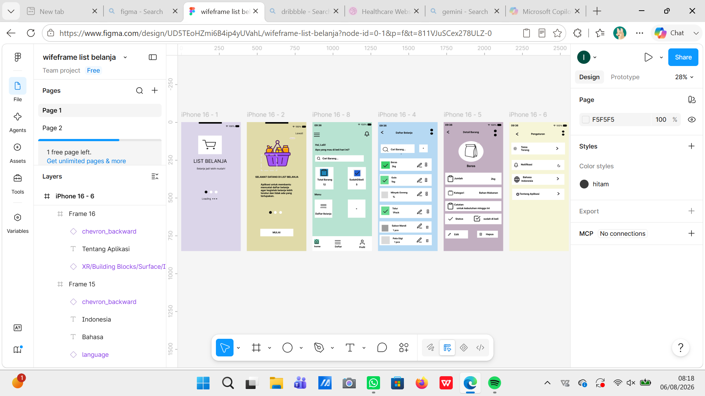

# Personal Branding Portfolio

## 👩‍💻 About Me

Hello! My name is **Laili Majida**. I am a student of **Software Engineering (Rekayasa Perangkat Lunak)** at **SMK Negeri 1 Pasuruan**.

I am interested in web development, UI design, and modern website development. This portfolio was created as part of my **Kelas Industri** project.

## 🚀 Technologies

- React
- Next.js
- Tailwind CSS
- TypeScript
- IndexedDB
- Leaflet Maps
- Figma

## 📂 Projects

### 1. Manajemen Siswa

A student management project for managing student data, classes, average grades, and violations.

**Tech:** Next.js, Tailwind CSS

### 2. Website Peta Sederhana

A simple interactive map website that displays locations in an easy-to-use interface.

**Tech:** Next.js, Tailwind CSS, Leaflet Maps

### 3. Aplikasi Daftar Belanja

A shopping list application design created with a simple and user-friendly interface.

**Tech:** Figma, UI Design

### 4. Personal Portfolio

A personal portfolio website containing information about me, my education, skills, and projects.

**Tech:** Next.js, Tailwind CSS

## 🎓 Education

**SMK Negeri 1 Pasuruan**

Rekayasa Perangkat Lunak (RPL)

Class: **XI RPL 1**

## 🛠️ Skills

- React — Intermediate-Advanced
- Next.js — Intermediate-Advanced
- TailwindCSS — Intermediate-Advanced
- IndexedDB — Intermediate
- Leaflet Maps — Intermediate

## 🌐 Portfolio

Visit my portfolio website:

**https://personal-branding-orpin-xi.vercel.app/**

## 📸 Portfolio Screenshots

### Home

### Projects

## 👤 Author

**Laili Majida**

SMK Negeri 1 Pasuruan — Rekayasa Perangkat Lunak